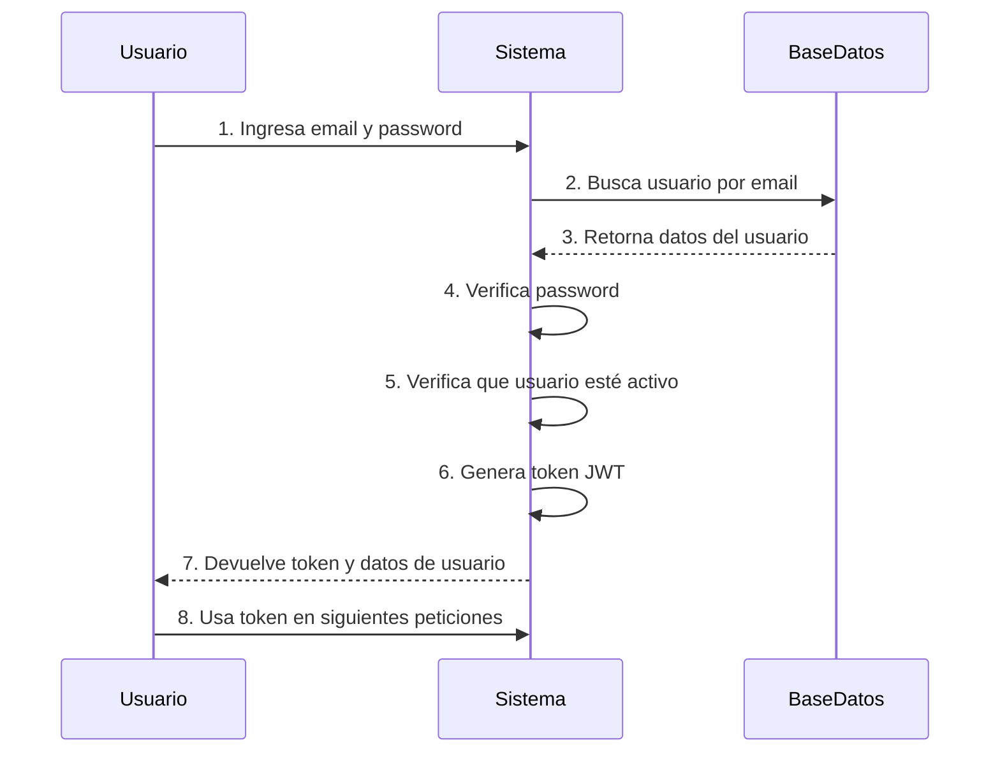
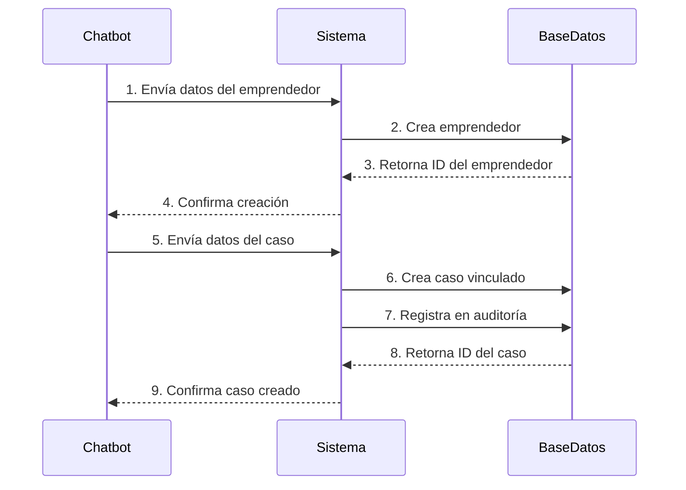
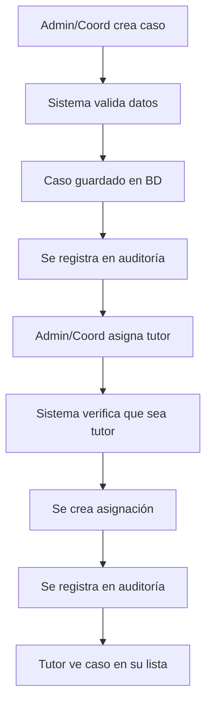
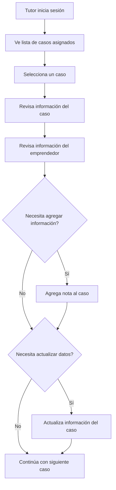
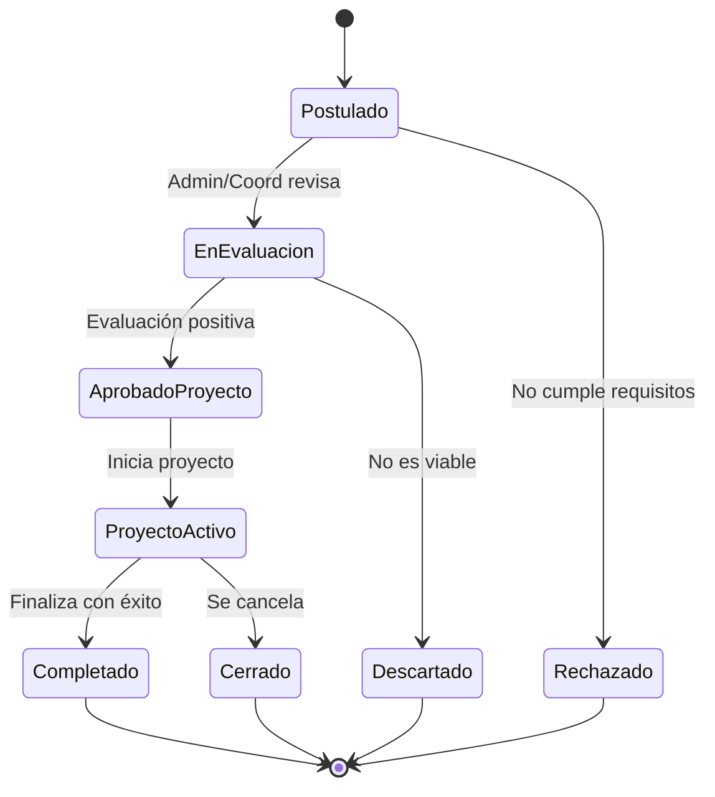
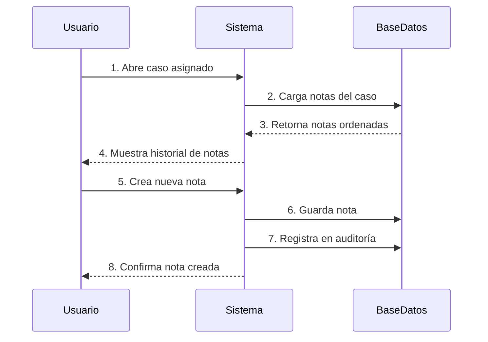
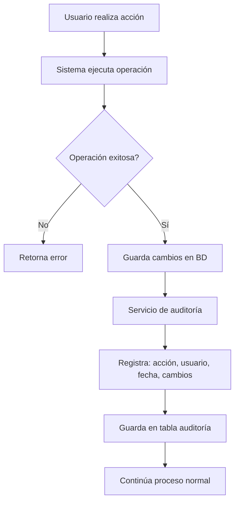
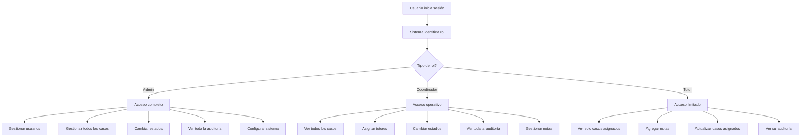

# 🔄 Flujos Críticos - Ithaka Backoffice

> Documentación de los flujos más importantes del sistema de gestión de postulaciones y proyectos

---

## 📑 Índice

1. [Flujo de Autenticación](#1-flujo-de-autenticación)
2. [Flujo de Registro desde Chatbot](#2-flujo-de-registro-desde-chatbot)
3. [Flujo de Creación y Asignación de Caso](#3-flujo-de-creación-y-asignación-de-caso)
4. [Flujo de Trabajo del Tutor](#4-flujo-de-trabajo-del-tutor)
5. [Flujo de Cambio de Estado de Caso](#5-flujo-de-cambio-de-estado-de-caso)
6. [Flujo de Gestión de Notas](#6-flujo-de-gestión-de-notas)
7. [Flujo de Auditoría](#7-flujo-de-auditoría)
8. [Flujo de Acceso Según Rol](#8-flujo-de-acceso-según-rol)

---

## 1. Flujo de Autenticación

### 📋 Objetivo
Permitir que los usuarios accedan al sistema de forma segura mediante JWT.

### 🔐 Pasos



**Pasos detallados:**

1. Usuario ingresa su email y contraseña
2. Sistema busca el usuario en la base de datos por email
3. Sistema verifica que la contraseña sea correcta (hash bcrypt)
4. Sistema verifica que el usuario esté activo
5. Sistema genera un token JWT con la información del usuario (id, email, rol)
6. Sistema devuelve el token JWT al usuario (válido por 30 minutos)
7. Usuario incluye el token en todas las peticiones subsiguientes
8. Sistema valida el token en cada petición y verifica permisos

---

## 2. Flujo de Registro desde Chatbot

### 📋 Objetivo
Capturar las postulaciones de emprendedores que llegan a través del chatbot conversacional.

### 🤖 Pasos



**Pasos detallados:**

1. Chatbot recopila información del emprendedor (nombre, email, teléfono, vínculo institucional)
2. Chatbot envía datos del emprendedor al sistema
3. Sistema crea el emprendedor en la base de datos
4. Sistema retorna el ID del emprendedor creado
5. Chatbot envía información del caso (nombre del proyecto, descripción, respuestas del chatbot)
6. Sistema crea el caso vinculado al emprendedor con estado inicial "Postulado"
7. Sistema registra la creación del caso en auditoría
8. Sistema retorna confirmación con ID del caso
9. Chatbot notifica al usuario que su postulación fue recibida

**⚠️ Importante:**
- El email del emprendedor debe ser único
- El caso se crea siempre en estado "Postulado" (id_estado: 1)

---

## 3. Flujo de Creación y Asignación de Caso

### 📋 Objetivo
Crear un nuevo caso en el sistema y asignarlo a uno o más tutores para su seguimiento.

### 👥 Pasos



**Pasos detallados:**

1. Admin o Coordinador identifica necesidad de crear un caso
2. Selecciona el emprendedor asociado
3. Ingresa nombre y descripción del caso
4. Selecciona el estado inicial del caso
5. Opcionalmente selecciona convocatoria asociada
6. Sistema guarda el caso en la base de datos
7. Sistema registra la creación en auditoría
8. Admin o Coordinador selecciona uno o más tutores
9. Sistema verifica que los usuarios sean tutores activos
10. Sistema crea las asignaciones correspondientes
11. Sistema registra las asignaciones en auditoría
12. Los tutores asignados ven el caso automáticamente en su lista

**⚠️ Importante:**
- Un caso puede tener múltiples tutores asignados
- Solo usuarios con rol "Tutor" pueden ser asignados
- Los tutores solo ven casos que les fueron asignados

---

## 4. Flujo de Trabajo del Tutor

### 📋 Objetivo
Acompañar y dar seguimiento a los casos asignados al tutor.

### 📝 Pasos



**Pasos detallados:**

1. Tutor inicia sesión en el sistema
2. Sistema muestra únicamente los casos asignados al tutor
3. Tutor selecciona un caso para trabajar
4. Tutor revisa la información del caso y del emprendedor
5. Tutor lee las notas existentes de otros tutores o coordinadores
6. Tutor agrega notas sobre reuniones, avances o decisiones
7. Tutor puede actualizar información del caso (descripción, datos adicionales)
8. Sistema registra todas las acciones en auditoría
9. Tutor puede ver el historial completo de cambios del caso
10. Tutor repite el proceso con otros casos asignados

**⚠️ Importante:**
- Tutores NO pueden cambiar el estado del caso
- Tutores solo pueden editar sus propias notas
- Tutores NO pueden ver casos que no les fueron asignados

---

## 5. Flujo de Cambio de Estado de Caso

### 📋 Objetivo
Gestionar el ciclo de vida de un caso desde la postulación hasta su finalización.

### 🔄 Pasos



**Pasos detallados:**

### Para Postulaciones:

1. **Postulado** (estado inicial)
   - El caso ingresa al sistema desde el chatbot o manualmente
   - Queda en espera de revisión

2. **Admin/Coordinador revisa el caso**
   - Lee la descripción y datos del emprendedor
   - Evalúa si cumple requisitos mínimos

3. **Decisión de revisión:**
   - Si NO cumple → Cambia a estado "Rechazado" (finaliza)
   - Si cumple → Cambia a estado "En Evaluación"

4. **En Evaluación**
   - Se asigna tutor para evaluación profunda
   - Se realizan reuniones con el emprendedor
   - Se analiza viabilidad del proyecto

5. **Decisión de evaluación:**
   - Si NO es viable → Cambia a estado "Descartado" (finaliza)
   - Si es viable → Cambia a estado "Aprobado Proyecto"

### Para Proyectos:

6. **Aprobado Proyecto**
   - El proyecto es aceptado oficialmente
   - Se prepara documentación y recursos

7. **Proyecto Activo**
   - El proyecto está en desarrollo
   - Tutores dan seguimiento continuo
   - Se registran avances en notas

8. **Finalización:**
   - Si completa exitosamente → Cambia a estado "Completado"
   - Si se cancela/abandona → Cambia a estado "Cerrado"

**⚠️ Importante:**
- Solo Admin y Coordinador pueden cambiar estados
- Cada cambio de estado se registra en auditoría
- No se puede volver a estados anteriores (flujo unidireccional)

---

## 6. Flujo de Gestión de Notas

### 📋 Objetivo
Documentar el progreso, reuniones y decisiones relacionadas con cada caso.

### 📝 Pasos



**Pasos detallados:**

### Crear Nota:

1. Usuario (Admin, Coordinador o Tutor) abre un caso
2. Sistema carga todas las notas existentes del caso
3. Usuario lee el historial de notas
4. Usuario identifica necesidad de agregar información
5. Usuario escribe el contenido de la nota
6. Sistema guarda la nota vinculada al caso y al usuario
7. Sistema registra la creación en auditoría
8. La nota aparece en el historial con fecha y autor

### Editar Nota:

1. Usuario ve el historial de notas
2. Usuario identifica una nota que necesita actualizar
3. Sistema verifica permisos:
   - Admin/Coordinador: puede editar cualquier nota
   - Tutor: solo puede editar sus propias notas
4. Si tiene permiso, usuario edita el contenido
5. Sistema guarda los cambios
6. Sistema registra la edición en auditoría

### Eliminar Nota:

1. Usuario identifica una nota que debe eliminarse
2. Sistema verifica permisos (igual que editar)
3. Si tiene permiso, usuario confirma eliminación
4. Sistema elimina la nota
5. Sistema registra la eliminación en auditoría

**⚠️ Importante:**
- Cada nota se vincula automáticamente al usuario que la crea
- Las notas incluyen timestamp de creación y última modificación
- Tutores solo pueden editar/eliminar sus propias notas
- Las notas son parte del historial permanente del caso

---

## 7. Flujo de Auditoría

### 📋 Objetivo
Mantener un registro completo y automático de todas las acciones importantes del sistema.

### 📊 Pasos



**Pasos detallados:**

### Registro Automático:

1. Usuario realiza una acción (crear, actualizar, eliminar)
2. Sistema valida permisos del usuario
3. Sistema ejecuta la operación en la base de datos
4. Si es exitosa, se activa el servicio de auditoría
5. Servicio registra:
   - Tipo de acción realizada
   - Usuario que la ejecutó
   - Fecha y hora exacta
   - Caso o entidad afectada
   - Detalles de los cambios (valores anteriores y nuevos)
6. Registro se guarda en tabla de auditoría
7. Registro es inmutable (no se puede modificar ni eliminar)

### Consulta de Auditoría:

1. Usuario con permisos solicita ver auditoría
2. Sistema verifica permisos:
   - Admin/Coordinador: ven toda la auditoría
   - Tutor: solo ve su propio historial
3. Usuario puede filtrar por:
   - Caso específico
   - Usuario específico
   - Rango de fechas
   - Tipo de acción
4. Sistema retorna registros ordenados cronológicamente
5. Usuario analiza el historial de cambios

### Historial de Caso:

1. Usuario abre un caso
2. Usuario solicita ver el historial completo
3. Sistema carga todos los registros de auditoría del caso
4. Sistema presenta línea de tiempo con:
   - Creación del caso
   - Asignaciones de tutores
   - Cambios de estado
   - Notas agregadas
   - Actualizaciones realizadas
5. Usuario puede ver quién hizo cada cambio y cuándo

**⚠️ Importante:**
- La auditoría se registra automáticamente, no requiere acción manual
- Los registros son inmutables para garantizar integridad
- Cada acción se vincula al usuario que la ejecutó
- La auditoría es esencial para cumplir con requisitos de trazabilidad

---

## 8. Flujo de Acceso Según Rol

### 📋 Objetivo
Controlar qué usuarios pueden realizar qué acciones en el sistema según su rol.

### 🔐 Pasos



**Pasos detallados:**

### Al Iniciar Sesión:

1. Usuario ingresa credenciales
2. Sistema valida las credenciales
3. Sistema identifica el rol del usuario (Admin, Coordinador, Tutor)
4. Sistema genera token JWT con información del rol
5. Sistema configura permisos según el rol

### En Cada Petición:

1. Usuario intenta realizar una acción
2. Sistema extrae el token JWT de la petición
3. Sistema verifica que el token sea válido
4. Sistema identifica el rol del usuario desde el token
5. Sistema verifica si el rol tiene permiso para la acción
6. Si NO tiene permiso → retorna error 403 (Prohibido)
7. Si tiene permiso → continúa con la acción
8. Para Tutores: aplica filtros adicionales (solo casos asignados)

### Permisos por Rol:

**Admin:**
- Puede realizar TODAS las acciones del sistema
- Puede crear, editar y desactivar usuarios
- Puede asignar/cambiar roles de usuarios
- Ve todos los casos y toda la información
- Puede cambiar cualquier configuración

**Coordinador:**
- Puede ver todos los casos del sistema
- Puede asignar tutores a casos
- Puede cambiar estados de casos
- Puede crear y editar notas en cualquier caso
- Puede ver toda la auditoría del sistema
- NO puede gestionar usuarios ni roles

**Tutor:**
- Solo ve casos que le fueron asignados
- Puede agregar notas en sus casos asignados
- Puede actualizar información de sus casos
- Puede ver historial de sus casos
- NO puede cambiar estados
- NO puede ver casos de otros tutores
- Solo ve su propio historial en auditoría

### Validación de Acceso a Casos (Tutores):

1. Tutor intenta acceder a un caso
2. Sistema busca si existe asignación del tutor a ese caso
3. Si NO existe asignación → retorna error 403
4. Si existe asignación → permite el acceso
5. En listados, sistema filtra automáticamente solo casos asignados

**⚠️ Importante:**
- Los permisos se validan en cada petición
- El rol está codificado en el token JWT
- Los tutores ven una versión filtrada del sistema automáticamente
- Cambiar el rol de un usuario requiere un nuevo login para actualizar permisos
- Los intentos de acceso no autorizado se registran en auditoría

---

## 🎯 Flujos Completos Integrados

### Caso Completo: Desde Chatbot hasta Proyecto Activo

1. **Postulación (Chatbot)**
   - Emprendedor conversa con chatbot
   - Chatbot crea emprendedor en sistema
   - Chatbot crea caso en estado "Postulado"

2. **Revisión Inicial (Admin/Coordinador)**
   - Admin revisa nuevos casos postulados
   - Admin verifica información básica
   - Admin cambia estado a "En Evaluación"

3. **Asignación (Admin/Coordinador)**
   - Admin selecciona tutor apropiado
   - Admin crea asignación
   - Tutor recibe notificación (opcional)

4. **Evaluación (Tutor)**
   - Tutor ve caso en su lista
   - Tutor contacta al emprendedor
   - Tutor realiza reuniones de evaluación
   - Tutor agrega notas con observaciones

5. **Decisión (Admin/Coordinador)**
   - Revisa notas del tutor
   - Evalúa viabilidad del proyecto
   - Cambia estado a "Aprobado Proyecto" o "Descartado"

6. **Proyecto (Si es aprobado)**
   - Admin cambia estado a "Proyecto Activo"
   - Tutor continúa acompañamiento
   - Se registran avances en notas
   - Cuando finaliza → estado "Completado" o "Cerrado"

### Todo el Proceso:
```
Chatbot → Postulado → En Evaluación → Aprobado → Activo → Completado
                                    ↓              ↓
                                Rechazado    Descartado/Cerrado
```

---

## 📚 Documentos Relacionados

- **PERMISOS_POR_ROL.md** - Matriz detallada de permisos
- **ENDPOINTS_CHATBOT.md** - Integración con chatbot
- **GUIA_JWT.md** - Configuración de autenticación
- **tests/test_flujos_completos.py** - Tests automatizados de flujos

---

**Última actualización:** 23 de febrero de 2026  
**Versión:** 1.0
